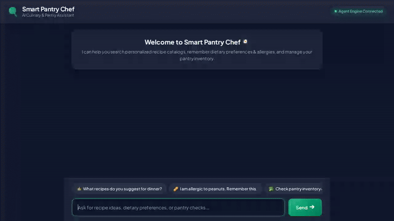

# Smart Pantry Chef 🍳

An intelligent, memory-aware AI culinary assistant powered by the **Google Agent Development Kit (ADK)**, **Vertex AI**, **Firestore**, and **Cloud Storage**. Smart Pantry Chef helps users discover recipes based on pantry inventory, remembers long-term dietary restrictions and food allergies, generates custom food imagery and short cooking videos, and renders interactive UI components.



---

## 🌟 Key Capabilities

Based on the implemented codebase in `app/`, Smart Pantry Chef provides:

- 🥗 **Pantry & Recipe Search**: Queries an internal Cloud Firestore database (`recipes` collection) filtering by cuisine, ingredients, and preparation time.
- 🧠 **Memory Bank Integration**: Automatically persists and retrieves user dietary preferences, food dislikes, and allergies across sessions using Vertex AI Memory Bank.
- 🖼️ **AI Food Photo Generation**: Generates high-quality images for dish concepts using `gemini-3.1-flash-lite-image`, automatically saving artifacts and serving them via Google Cloud Storage.
- 🎥 **AI Cooking Video Generation**: Generates short dish preparation videos using Google's Omni model (`gemini-omni-flash-preview`) in the `global` region, uploading raw bytes directly to Google Cloud Storage.
- 🌐 **External Web Recipe Lookup**: Fetches real online recipe ideas from TheMealDB public API when local pantry searches require broader inspiration.
- 🎨 **A2UI Declarative Interface**: Renders structured A2UI (v0.8) cards, text hierarchies, and images directly within supported chat surfaces.

---

## ☁️ Google Cloud Services & Technologies Used

- **Framework**: Google Agent Development Kit (ADK) `google-adk`
- **LLM Engine**: `gemini-3.8-flash` via Vertex AI
- **Memory Service**: `VertexAiMemoryBankService` for long-term user memory management
- **Database**: Google Cloud Firestore (`recipes` collection)
- **Object Storage**: Google Cloud Storage (public media bucket for image and video hosting)
- **Image Generation**: Vertex AI `gemini-3.1-flash-lite-image`
- **Video Generation**: Vertex AI `gemini-omni-flash-preview` (`global` region)
- **Code Execution**: `AgentEngineSandboxCodeExecutor`
- **UI Protocol**: A2UI (Agent-to-User Interface) v0.8 catalog

---

## 📋 Planned / Unimplemented Features

Features mentioned in early design drafts that are *planned, but not yet implemented* in the code:
- 🛒 **Automated Grocery Cart Integration**: Auto-populating missing ingredients into third-party delivery services.
- 📷 **Barcode / IoT Smart Fridge Scanner**: Hardware camera feed integration for real-time item tracking.

---

## 🛠️ Local Setup & Running Instructions

### Prerequisites
- Python 3.10+
- Google Cloud SDK (`gcloud`) authenticated to your GCP project
- Active Cloud Firestore database and Cloud Storage bucket

### 1. Installation
Clone the repository and install dependencies:

```bash
# Create and activate virtual environment
python3 -m venv .venv
source .venv/bin/activate

# Install requirements
pip install -r requirements.txt
```

### 2. Configure Environment Variables
Set your Google Cloud resource identifiers:

```bash
export GOOGLE_CLOUD_PROJECT="<YOUR_GCP_PROJECT_ID>"
export AGENT_ENGINE_RESOURCE_NAME="projects/<PROJECT_NUMBER>/locations/us-east1/reasoningEngines/<ENGINE_ID>"
export AGENT_DIRECTORY="app"
```

### 3. Run Frontend Server Locally
Start the FastAPI server from the `frontend/` folder:

```bash
cd frontend
python main.py
```

The web interface will start listening on port `8080`. Open your browser and navigate to the local server address.

---

## 🚀 Deployment to Agent Platform

Deploy the root agent to Vertex AI Reasoning Engine using the `agents-cli` tool:

```bash
agents-cli deploy --project <YOUR_GCP_PROJECT_ID> --region us-east1
```
